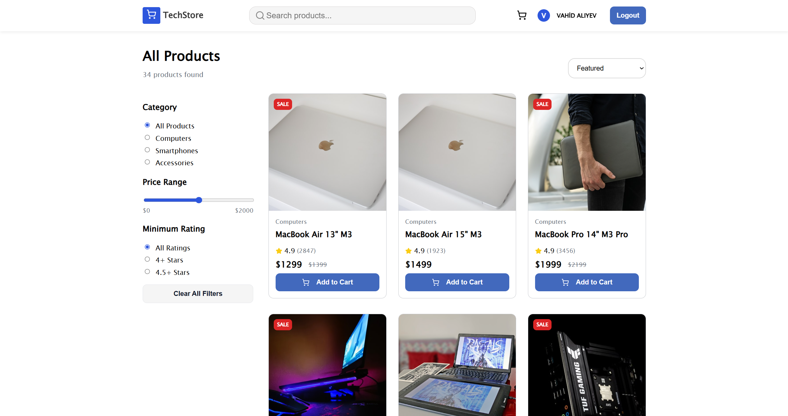
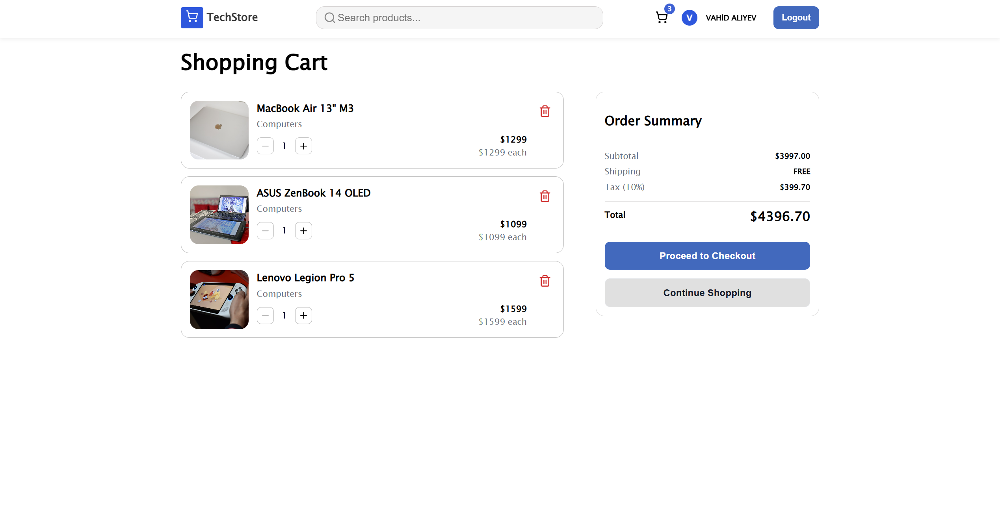
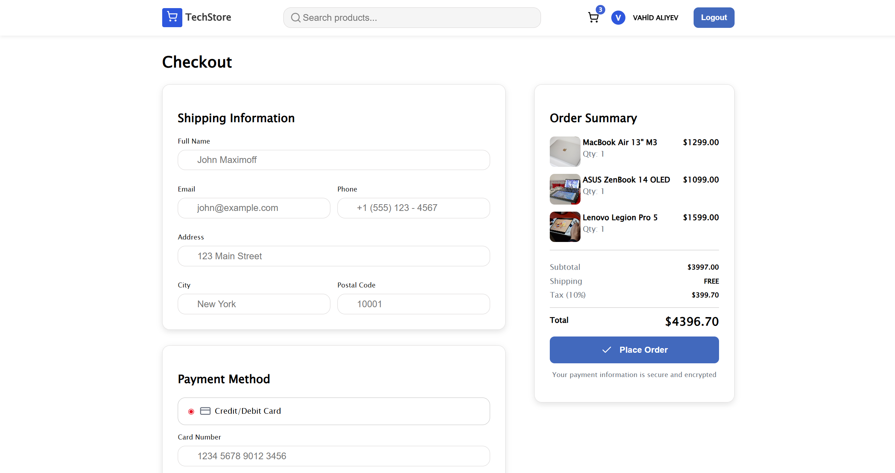

# Tech Store

A modern e-commerce frontend built with **React**, **TypeScript**, and **Vite**.  
Tech Store includes product browsing, filtering, cart management, checkout flow, and Firebase-based authentication.

**Live Demo:** [View Project](https://vahid2104.github.io/Tech_Store/)

## Screenshots

### Home

### Products

### Cart

### Checkout

## Features

- Product listing page with:
  - search
  - category filtering
  - price filtering
  - rating filtering
  - sorting options
- Product details page
- Shopping cart with persistent state via local storage
- Checkout flow with order summary
- User authentication with Firebase
  - email/password sign in
  - email/password registration
  - Google sign in
- Account page
- Order success page
- Additional informational pages:
  - About
  - Contact
  - Help Center
  - Shipping
  - Returns
  - Careers
- Responsive UI with reusable components

## Tech Stack

- **React 19**
- **TypeScript**
- **Vite**
- **React Router DOM**
- **Firebase Authentication**
- **Formik**
- **Yup**
- **Lucide React**
- **CSS Modules**
- **clsx**

## Project Structure

src
├── app
│   ├── assets
│   ├── components
│   ├── context
│   ├── data
│   ├── hooks
│   ├── pages
│   ├── schemas
│   ├── styles
│   ├── types
│   ├── App.tsx
│   ├── Layout.tsx
│   └── routes.tsx
├── lib
│   └── firebase.ts
├── index.css
└── main.tsx

## Pages
- / — Home
- /login — Login
- /register — Register
- /account — User account
- /products — Product catalog
- /products/:id — Product details
- /cart — Shopping cart
- /checkout — Checkout
- /order-success — Order success
- /contact — Contact page
- /help — Help center
- /shipping — Shipping information
- /returns — Returns information
- /about — About page
- /careers — Careers page

## Authentication
This project uses **Firebase Authentication**.

Supported auth methods:
- Email and password login
- Email and password registration
- **Google sign-in**

## Cart System
The cart is managed through a custom context and includes:
- add to cart
- remove from cart
- update quantity
- clear cart
- cart item count
- cart total calculation

Cart data is stored in localStorage, so it persists between page reloads.

## Form Validation
Form validation is handled with **Formik** and **Yup**.

Example validations include:
- full name minimum length
- valid email format
- password minimum length
- password confirmation match
- terms acceptance

## Environment Variables
Create a .env file in the project root and add your Firebase credentials:
- VITE_FIREBASE_API_KEY=
- VITE_FIREBASE_AUTH_DOMAIN=
- VITE_FIREBASE_PROJECT_ID=
- VITE_FIREBASE_STORAGE_BUCKET=
- VITE_FIREBASE_MESSAGING_SENDER_ID=
- VITE_FIREBASE_APP_ID=

*Note*: If your Firebase setup also uses Analytics or other services, you may additionally need VITE_FIREBASE_MEASUREMENT_ID.

## Getting Started
1. Clone the repository
git clone https://github.com/vahid2104/Tech_Store.git
cd Tech_Store
2. Install dependencies
npm install
3. Configure environment variables

Create a .env file based on .env.example and fill in your Firebase values.

4. Start the development server
npm run dev

## Available Scripts
- npm run dev      # Start development server
- npm run build    # Build for production
- npm run lint     # Run ESLint
- npm run preview  # Preview production build

## Deployment
This project includes a GitHub Actions workflow for deployment to GitHub Pages.

The deployment pipeline:
- installs dependencies
- builds the project
- injects Firebase environment variables from GitHub Secrets
- uploads the dist folder
- deploys to GitHub Pages

## Reusable Components

The project includes reusable UI pieces such as:
- Button
- Input
- Navbar
- Footer
- ProductCard
- Loading
- EmptyState
- PrivacyModal
- TermsModal
- ScrollToTop

## Sample Product Categories

The store data currently includes categories such as:
- Computers
- Smartphones
- Accessories

## Notes
- This project is primarily a frontend e-commerce application.
- Product data is currently provided from local project data.
- Checkout currently simulates payment processing on the frontend.

## Future Improvements
- Backend integration for real orders
- Product API and admin dashboard
- Wishlist feature
- Payment gateway integration
- Order history persistence
- Better stock management
- Unit and integration tests

## Author
Vahid Aliyev

## License
This project is for educational and portfolio purposes.